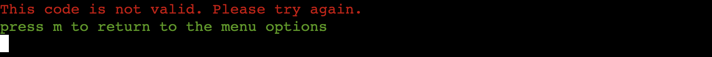

# **The Coffee Run App**

The Coffee Run App has been developed as part of the Code Institute Diploma in Full Stack Software Development (Portfolio Project #3 - Python Essentials).  The app targets people on a busy schedule who want the ability to order their coffee in advance and pick up at a designated time.

## **CONTENTS**

* [User Experience (UX)](#user-experience-ux)
    * [Strategy](#strategy)
        * [Project Goals](#project-goals)
        * [User Stories](#user-stories)
    * [Scope](#scope)
    * [Design](#design)
* [Technologies Used](#technologies-used)
    * [Languages Used](#languages-used)
    * [Frameworks, Libraries and Programs Used](#frameworks-libraries-and-programs-used)
* [Deployment and Local Development](#deployment-and-local-development)
* [Testing](#testing)
* [Bugs](#bugs)
    * [Known Bugs](#known-bugs)
    * [Solved Bugs](#solved-bugs)
* [Credits](#credits)
    * [Code Used](#code-used)
    * [Content](#content)
    * [Media](#media)
    * [Acknowledgements](#acknowledgements)

# **User Experience (UX)**

## **STRATEGY**
___

## **Project Goals**

 

The client for this project is a fictional coffee shop although this scenario could be applied to many real world examples.  The business is based next door to a train station and therefore a large part of revenue comes from take away orders.  The cafe space itself is relatively small, and the owner has noticed that at peak times of train travel this space becomes quickly overcrowded and cramped with takeaway customers waiting for their order.  This means that prospective customers may not even attempt to purchase a coffee as they are put off by the queue.  It also degrades the customer experience of those who have chosen to sit in and enjoy a more leisurely coffee.  The owner has also observed that many of the takeaway customers are purchasing their coffee with the intention of then jumping on the train as part of their commute to work.  Customers are left unhappy if the amount of time spent waiting for their coffee to be made, results in them missing their train and being late for work.

The aim of the project is to therefore develop an app that can be used by customers to order their takeaway coffee in advance and be provided a specific pickup time.  This should improve the customer experience and remove one element of stress from their daily commute. Another target user for the app will be those doing the office 'coffee run', who normally place quite large orders with various different types of coffee.  The ability to order in advance means there will not be a long wait for the customer when arriving at the cafe as their order will be ready to take away. 

Along with a reduction in overcrowding at peak times, the cafe owner also hopes that the data collected from the app will provide a valuable insight for the business. They hope analysis of this data will help to build a profile of the busiest times of the day/ week and allow them to schedule staffing appropiately so sufficient baristas are on shift to manage the demand.  The app will also provide the business with sales data, which they can use to inform them in stock buying decisions for coffee beans and milk.  

 

## **User Stories**

 

### Client Goals:

 

* As the client, I want to reduce queues building up inside/outside the coffee shop and maximise the number of customers that can get their coffee before catching their train.
* As the client, I want to ensure a high quality coffee experience even during the busiest times.
* As the client, I want to collect data from orders made via the app to make future business decisions.
* As the client, I want to collect data which gives an overview of daily coffee sales to ensure appropriate levels of stock are ordered.
* As the client, I want all user input to be validated
* As the client, I want to ensure a good user experience by making the app easy to use and intuitive 
* As the client, I want to keep the user informed througout the ordering process by providing feedback at each stage.

 

### User Goals:

 

* As the user, I want to view all avaialble coffee & milk options to make my choice.
* As the user, I want to order my coffee quickly and for the experience to be intuitive.
* As the user, I want to be provided clear information about when my order will be ready to pickup.
* As the user, I want to accrue loyalty points for each coffee order.
* As the user, I want loyalty rewards to be deducted from my order total.
* As the user, I want to be able to view my order details and reference number once the order has been placed. 

 

## **SCOPE**
___

In order to satisfy the goals outlined in the project strategy, I will implement the following features:

* Allow user to enter username details in order to collect and redeem loyalty points on the order.
* Present the user with a coffee price menu from which they can select their type of coffee.
* Allow the user to select the type of milk.
* Allow the user to select if they would prefer decaffeinated.
* Allow the user to add 0.5, 1 or 2 sugars.
* Select the quantity they would like of this particular coffee.
* Provide the option for user to add additional items to their order before finalising.
* Log time and date of order to base estimated pick up time on.
* Provide the user with a finalised order summary, with order details, price, estimated pickup time and unique order reference.
* Update the "orders" sheet with order data that can be used by the client to prepare the necessary coffee.
* Update the "sales" sheet with order data that can be used by the client in future business decision making.

 

Future implementations that are not within the scope of this project but could be added at a later date to enhance the user experience would be:

* The ability for the user to pay for the order using the app, to make the pickup process even smoother and quicker.

 

## **DESIGN**
___

 

## **Flow Charts**

 

## **Features**

 

## **Main Menu**

 

When loading the app, users land on the main menu page so they can immediately access the service they need.  The large 'Coffee Run' title at the top was created using the Pyfiglet module and let's the user know that they have come to the right place to order coffee.

4 options are provided.  Number 1 allows the user to start the process of ordering their coffee.  I have given this option priority, as this is the main reason why most users will access the app.  Number 2 allows the user to access details of an order that has already been submitted.  Number 3 is an admin view designed for the owner of the coffee shop so they can access information about sales based on the data collected by the app.  Option 4 gives the user an opportunity to quit the app.  I have only made this option available at this level of the program, as this is where users return once an order has been submitted.

Users are prompted to enter a number between 1 and 4 which correspond with the menu options.  User input here must pass validation here before progressing to the next step.  If a non valid number or any character is entered by the user, feedback is displayed to the user in the form of the following message:

## **Order Coffee**

 

When selecting option 1 in the main menu, the user will first be prompted to enter a name:

To pass validation, the name entered must only contain letters.  The following feedback is displayed if this validation test is not passed:

The name provided by the user is limited to 10 characters.  If they input more than this, the following feedback is displayed and they are prompted to try again:

Once a valid name has been provided, the user is presented with a personalised message using the name they provided in the previous step.  The coffee types available to order and their prices are displayed in table format - created using the python module tabulate.  Users are encouraged to enter the coffee they want by entering the corresponding code from the table:

If the code entered by the user does not pass validation, the following feedback is provided:

Once a valid code has been entered for selection of coffee type, the user progresses to the next stage, where they can specify the milk they would prefer:

Again, the code entered for milk choice must pass validation before the user can progress.  The following feedback is presented if an invalid code is entered:

The next step in the ordering process is to specify the quantity required of the selected coffee:

If the user tries to enter a quantity using a non numeric value, they receive the following feedback:

Users are only allowed to order a maximum of 5 drinks per order.  I mainly chose this number so I was still able to display the largest orders in the terminal display without scrolling.  In reality, this number could be made greater by the coffee shop owner.  If a user tries to order more than 5 drinks, the following feedback is displayed:

Once a valid quantity has been input, the user is presented with a summary of their current order in table format:

To view their next options, users are prompted to enter 'm'.  If an invalid character is entered, the following feedback is displayed:

 

## **Order Options**

 

The user is presented with 6 options of how they can proceed and are prompted to enter a code corresponding to an action in the table menu:

If the code input the user does not pass validation, the following feedback is displayed:

### **Option 1: Add an item to order**

 

If this is selected, the user will cycle back over the 'Order Coffee' steps outlined above.  In total they can enter 5 drinks to their order.  If at any time they quantity they select pushes total drinks over 5, they will be given feedback and prompted to enter a different quantity. If they are unable to add any more drinks to their order because they have reached the maximum of 5, the following will be displayed:

### **Option 2: Remove an item**

 

If a user chooses to remove an item, they are presented with the following summary of their order and prompted to select the item they wish to remove:

If the user inputs an invalid item code to remove, they will be presented with the following feedback:

# **Technologies Used**

## **Languages Used**

 

Python was used to create this project.

 

## **Frameworks, Libraries and Programs Used**

 

# **Deployment and Local Development**

 

# **Testing**

 

## **Bugs**

 

# **Credits**

## **Code Used**

 

[Using Tabulate in Python](https://www.askpython.com/python-modules/tabulate-tables-in-python)

[Getting values from dictionaries in Python](https://www.codingem.com/python-dict-get-method-vs-square-brackets/)

[Adding two lists to a dictionary in Python](https://pythonhow.com/how/convert-two-lists-into-a-dictionary/#:~:text=You%20can%20use%20the%20zip,values%20into%20a%20single%20iterable.)

## **Content**

 

## **Media**

 

## **Acknowledgements**

 
