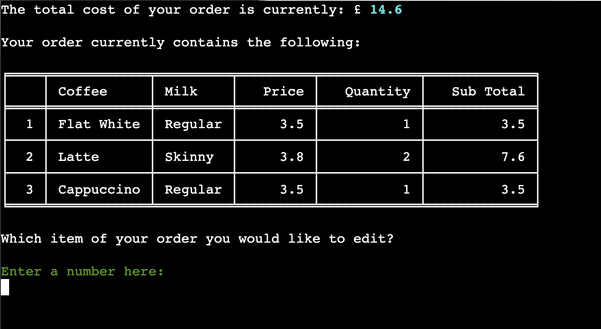
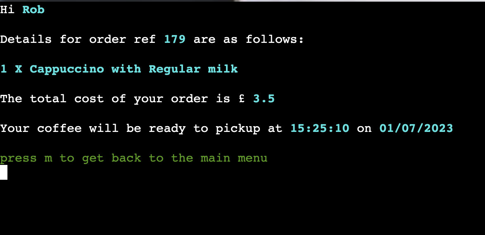
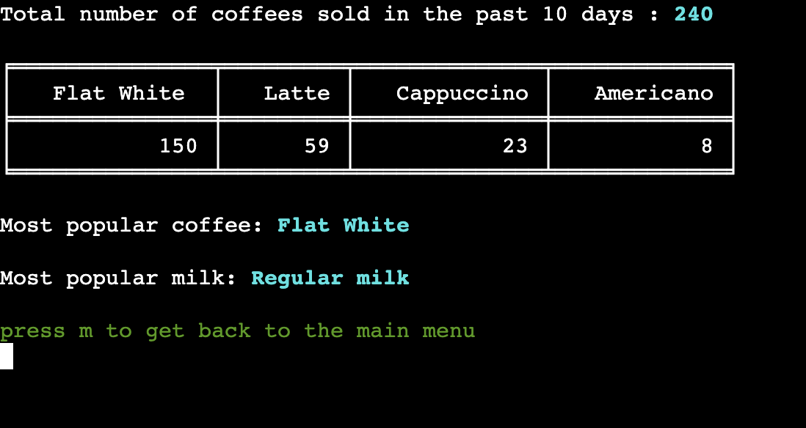

# **The Coffee Run App**

The Coffee Run App has been developed as part of the Code Institute Diploma in Full Stack Software Development (Portfolio Project #3 - Python Essentials).  The app targets people on a busy schedule who want the ability to order their coffee in advance and pick up at a designated time.

## **CONTENTS**

* [User Experience (UX)](#user-experience-ux)
    * [Strategy](#strategy)
        * [Project Goals](#project-goals)
        * [User Stories](#user-stories)
    * [Scope](#scope)
    * [Design](#design)
* [Technologies Used](#technologies-used)
    * [Languages Used](#languages-used)
    * [Frameworks, Libraries and Programs Used](#frameworks-libraries-and-programs-used)
* [Deployment and Local Development](#deployment-and-local-development)
* [Testing](#testing)
* [Bugs](#bugs)
    * [Known Bugs](#known-bugs)
    * [Solved Bugs](#solved-bugs)
* [Credits](#credits)
    * [Code Used](#code-used)
    * [Content](#content)
    * [Media](#media)
    * [Acknowledgements](#acknowledgements)


# **User Experience (UX)**

## **STRATEGY**
___

## **Project Goals**

<br>

The client for this project is a fictional coffee shop although this scenario could be applied to many real world examples.  The business is based next door to a train station and therefore a large part of revenue comes from take away orders.  The cafe space itself is relatively small, and the owner has noticed that at peak times of train travel this space becomes quickly overcrowded and cramped with takeaway customers waiting for their order.  This means that prospective customers may not even attempt to purchase a coffee as they are put off by the queue.  It also degrades the customer experience of those who have chosen to sit in and enjoy a more leisurely coffee.  The owner has also observed that many of the takeaway customers are purchasing their coffee with the intention of then jumping on the train as part of their commute to work.  Customers are left unhappy if the amount of time spent waiting for their coffee to be made, results in them missing their train and being late for work.

The aim of the project is to therefore develop an app that can be used by customers to order their takeaway coffee in advance and be provided a specific pickup time.  This should improve the customer experience and remove one element of stress from their daily commute. Another target user for the app will be those doing the office 'coffee run', who normally place quite large orders with various different types of coffee.  The ability to order in advance means there will not be a long wait for the customer when arriving at the cafe as their order will be ready to take away. 

Along with a reduction in overcrowding at peak times, the cafe owner also hopes that the data collected from the app will provide a valuable insight for the business. They hope analysis of this data will help to build a profile of the busiest times of the day/ week and allow them to schedule staffing appropiately so sufficient baristas are on shift to manage the demand.  The app will also provide the business with sales data, which they can use to inform them in stock buying decisions for coffee beans and milk.  

<br>

## **User Stories**

<br>

### Client Goals:

<br>

* As the client, I want to reduce queues building up inside/outside the coffee shop and maximise the number of customers that can get their coffee before catching their train.
* As the client, I want to ensure a high quality coffee experience even during the busiest times.
* As the client, I want to collect data from orders made via the app to make future business decisions.
* As the client, I want to collect data which gives an overview of daily coffee sales to ensure appropriate levels of stock are ordered.
* As the client, I want all user input to be validated
* As the client, I want to ensure a good user experience by making the app easy to use and intuitive 
* As the client, I want to keep the user informed througout the ordering process by providing feedback at each stage.

<br>

### User Goals:

<br>

* As the user, I want to view all avaialble coffee & milk options to make my choice.
* As the user, I want to order my coffee quickly and for the experience to be intuitive.
* As the user, I want to be provided clear information about when my order will be ready to pickup.
* As the user, I want to be able to view my order details and pickup time once the order has been placed. 

<br>

## **SCOPE**
___

In order to satisfy the goals outlined in the project strategy, I will implement the following features:

* Allow user to enter username details so messages can be personalised throughout the order.
* Present the user with a coffee price menu from which they can select their type of coffee.
* Allow the user to select the type of milk.
* Select the quantity they would like of this particular coffee.
* Provide the option for user to add additional items to their order before finalising.
* Allow the user to remove items from their order.
* Allow the user to edit the quantity of an item in the order.
* Log time and date of order to base estimated pick up time on.
* Provide the user with a finalised order summary, with order details, price, estimated pickup time and unique order reference.
* Update the "orders" sheet with order data that can be used by the client to prepare the necessary coffee.
* Update the "sales" sheet with order data that can be used by the client in future business decision making.

<br>

Future implementations that are not within the scope of this project but could be added at a later date to enhance the user experience would be:

* The ability for the user to pay for the order using the app, to make the pickup process even smoother and quicker.

* The ability for users to create an account where they can accrue loyalty points for each coffee order and redeem them when sufficient total reached.

* Admin View can only be accessed with username and password login

* Increase options for the business owner in Admin View to manipulate the data in ways that are most useful to them.  More functions could be written to analyse and display the data as required.

<br>

## **DESIGN**
___

<br>

## **Flow Charts**

<br>


## **Features**

<br>

## **Main Menu**

<br>


When loading the app, users land on the main menu page so they can immediately access the service they need.  The large 'Coffee Run' title at the top was created using the Pyfiglet module and let's the user know that they have come to the right place to order coffee.

4 options are provided.  Number 1 allows the user to start the process of ordering their coffee.  I have given this option priority, as this is the main reason why most users will access the app.  Number 2 allows the user to access details of an order that has already been submitted.  Number 3 is an admin view designed for the owner of the coffee shop so they can access information about sales based on the data collected by the app.  Option 4 gives the user an opportunity to quit the app.  I have only made this option available at this level of the program, as this is where users return once an order has been submitted.

Users are prompted to enter a number between 1 and 4 which correspond with the menu options.  User input here must pass validation here before progressing to the next step.  If a non valid number or any character is entered by the user, feedback is displayed to the user in the form of the following message:


## **Order Coffee**

<br>

When selecting option 1 in the main menu, the user will first be prompted to enter a name:


To pass validation, the name entered must only contain letters.  The following feedback is displayed if this validation test is not passed:


The name provided by the user is limited to 10 characters.  If they input more than this, the following feedback is displayed and they are prompted to try again:


Once a valid name has been provided, the user is presented with a personalised message using the name they provided in the previous step.  The coffee types available to order and their prices are displayed in table format - created using the python module tabulate.  Users are encouraged to enter the coffee they want by entering the corresponding code from the table:


If the code entered by the user does not pass validation, the following feedback is provided:


Once a valid code has been entered for selection of coffee type, the user progresses to the next stage, where they can specify the milk they would prefer:


Again, the code entered for milk choice must pass validation before the user can progress.  The following feedback is presented if an invalid code is entered:


The next step in the ordering process is to specify the quantity required of the selected coffee:


If the user tries to enter a quantity using a non numeric value, they receive the following feedback:


Users are only allowed to order a maximum of 5 drinks per order.  I mainly chose this number so I was still able to display the largest orders in the terminal display without scrolling.  In reality, this number could be made greater by the coffee shop owner.  If a user tries to order more than 5 drinks, the following feedback is displayed:


Once a valid quantity has been input, the user is presented with a summary of their current order in table format:


To view their next options, users are prompted to enter 'm'.  If an invalid character is entered, the following feedback is displayed:


<br>

## **Order Options**

<br>

The user is presented with 6 options of how they can proceed and are prompted to enter a code corresponding to an action in the table menu:


If the code input the user does not pass validation, the following feedback is displayed:


### **Option 1: Add an item to order**

<br>

If this is selected, the user will cycle back over the 'Order Coffee' steps outlined above.  In total they can enter 5 drinks to their order.  If at any time they quantity they select pushes total drinks over 5, they will be given feedback and prompted to enter a different quantity. If they are unable to add any more drinks to their order because they have reached the maximum of 5, the following will be displayed:


### **Option 2: Remove an item from order**

<br>

If a user chooses to remove an item, they are presented with the following summary of their order and prompted to select the item they wish to remove:


If the user inputs an invalid item code to remove, they will be presented with the following feedback:


If the user enters a valid code corresponding to an item in their order, this will be removed from the order and an updated order summary displayed along with a prompt to return to the Order Options menu by entering 'm':


If the user were to remove all items from the order, on removing the final item, they would be directed back to the Main Menu display.

### **Option 3: Edit Quantities**

<br>

If the user chooses to edit the quantity of an item in the order, they are presented with the following summary of their order and prompted to select the itme they would like to edit:



If an invalid item code is input by the user, the following feedback is displayed:


The user is then prompted to enter the quantity that they would like of the item they are editing:


If the user attempts to enter an ammended quantity that would take the drinks total of the order over 5, they are presented with the following feedback:


Once the user has edited the quantity of the item with a valid value, a summary of the order displaying the ammended quantity and ammended price is shown, along with a prompt to return to the Order Options menu by entering 'm':


### **Option 4: View Current Order**

<br>

At any point during the order process, the user can choose to view their current order.  I originally had the current order displayed at all stages of the process, but I realised that this would not be possible if I wanted to work within the constraints of the deployed terminal display (24 rows in height) and not require the user to scroll.  Selecting option 4 provides a tabular view of the items currently in their order.  Entering 'm' takes the user back to the Order Options menu:


### **Option 5: Finalise Order**

<br>

Selecting option 5 takes the user to a page providing them with a personalised message to let them know that their order has been submitted. Key details of the order are also provided including their unique order reference number, the total amount due for the order on pickup, and the esitmated pickup time:


The user can then either choose to return to the main menu or view a summary of the items in their order.  The code entered by the user is validated here and an invalid entry will provide the following feedback:


Choosing option 1 will direct the user back to the main menu and choosing option 2 will display a summary of items in the submitted order, with an option to then return to the main menu:


## **View Existing Order**

<br>

Users of the app can view the details and status of an existing order if they have their order reference to hand.  Selecting option 2 on the main menu provides the user with the following prompt:


The order reference provided by the user, is checked against the list or order references stored in the "orders" sheet on the google sheets doc the_coffee_run.  If it cannot be matched, the following feedback is displayed:


If the order reference entered is found on the "orders" sheet, key information about the order is presented to the user:



When an existing order is called, the current time is checked against the estimated pickup time.  If current time is found to be greater than pickup time, the order will be shown as 'Ready':


## **Admin View**

<br>

This feature of the app is designed for use by the owners of the coffee shop.  As mentioned in the future implementations section, a username and password login stage would be created, so only those with admin credentials could access this option.  But for the purpose of this project, everyone can access to see this part of the app in action.

When selecting this option, the user is presented with some key stats that have been created through analysis of the sales data stored in the "sales" sheet in the google sheets doc. For the purpose of this project, I have chosen to collate the data from coffee sales over the past 10 days and display the total number of coffees sold in this time period, and also a breakdown of coffee types sold in tabular form.  I have also used this data to inform the business owner about which coffee type and milk choice was most popular over the 10 day period.  This is just an illustration of how this feature of the app could work. Moving forward, further functions could be written to manipulate and represent the data in a way that is most useful for the business owner and could help them make decisions about stock purchasing, staffing etc.



## **Quit App**

<br>

Once the user has done everything they want to do, they can quit the app by selecting option 4, which displays the following message:


<br>

# **Database**

Data is stored in a google sheets document and accessed by the app using the Google Drive and Google Sheets APIs.  The spreadsheet can be viwed here.  The spreadsheet consists of the following sheets:

## **Coffee**

<br>

This stores the coffee menu items and associated prices.  The Business owner could update pricing information on the sheet, and these updates would be mirrored on the app:


## **Milk**

<br>

This stores the milk menu options and associated prices:


## **Orders**

<br>

Once an order has been submitted on the app, it is appended as a row on the orders sheet.  It is this information that the coffee shop will use to put the order together:


## **Sales**

<br>

As an order is submitted, the elements of the order are broken down into sales data which is then appened as a row in the sales sheet:


# **Technologies Used**

## **Languages Used**

<br>

Python was used to create this project.

<br>

## **Frameworks, Libraries and Programs Used**

<br>

* Git -  Version control.
* GitHub - All files for the website stored and saved in a repository.
* Gitpod - IDE used to write the code.
* LucidChart -For creating a flow diagram
* Heroku - For deployment of the project.
* PEP8 CI Python Linter
* Black - Python Auto Formatter
* TinyPNG - For compression of image files to improve website performance.
* Birme - For resizing and re-formatting images to make them suitable for use on the website.
* Favicon.ico & App Icon Generator - for creating the 16x16px ico favicon.

* gspread - Used to access and update Google Sheets via an API
* google.oauth2.service_account - Credentials Class imported from this which then uses the creds.json file.
* pandas - Used to turn dictionaries to dataframes
* os - This module was imported so I could use the clear terminal command.
* tabulate -function imported from the tabulate module to display data in table format.
* datetime, timedelta & timezone imported from datetime module - This was used to get current time and date and also work out differences between current time and pickup time.
* pytz - for setting current time to the desired timezone.
* colored & cprint imported from termcolor module - This was used change font colours in order to differentiate types of information for the user.
* figlet imported from pyfiglet module - This was used to display 'Coffee Run' on the title page in a larger more interesting font.
* OrderedDict imported from collections - To make use of ordered dictionaries.


# **Deployment and Local Development**

<br>

## **Deployment to Heroku**

<br>

Before starting the deployment proceedure, I created a list of requirements in gitpod, by entering the folowing command in the terminal:

```
pip3 freeze > requirements.txt
```

Heroku then uses this requirements.txt file to install the required dependencies.

The following steps were followed to deploy the app to Heroku:

1.  Create an account and login to [Heroku](https://id.heroku.com/login)
2.  In the Heroku dashboard, click the 'New' button at the top right of the screen and then select "Create new app".
3.  I selected the name 'the-coffee-run' ,set my region to Europe and clicked on the 'Create app' button.


4.  Click on the settings tab and then click the 'Reveal Config Vars' button.


5.  In the field for Key, enter CREDS (All capital letters).


6.  From my Gitpod workspace, I went to my creds.json file which has been listed in the .gitignore file, copied the entire contents of this file and pasted it in the config var value field.  The click 'Add'.
7.  Add another config var, this time with the Key set to PORT and the value 8000.
8.  From the 'Buildpacks' section click on the 'Add buildpack' button.


9.  Select Python, then click 'save changes' button.
10.  Next add the node.js buildpack and click the 'save changes' button again.  **It is important that the buildpacks are added in this order.  If they have been added in the wrong order, they can be clicked and dragged so Python comes first and node.js is below it.**

11.  Next select the 'Deploy' tab, select GitHub as the deployment method, and click the 'Connect to GitHub' button.
12.  Search for the GitHub repository name in the 'App Connected to GitHub' section and then click the 'connect' button'


13.  You can now choose to enable automatic deploys or deploy manually.  When the 'automatic deploys' button is clicked and enabled, Heroku will rebuild the app every time a new change is pushed to GitHub.  In the 'Manual deploy' section, the 'Deploy branch' button can be clicked to deploy manually.


14.  I chose to deploy manually. Once the app is built, a link is provided to the [deployed app](https://the-coffee-run.herokuapp.com/).


<br>

## **Local Development**

<br>

### **How to fork:**

<br>

1. Log in (or sign up) to GitHub.
2. Find the required repository, in this case: rkillickdev/the-coffee-run
3. Click on the "fork" button at the top right of the page.

<br>

### **How to clone:**

<br>

1. Log in (or sign up) to GitHub.
2. Find the required repository, in this case: rkillickdev/the-coffee-run
3. Click on the green code button.  This will give you the choice of cloning the repository using HTTPS, an SSH key or GitHub CLI.  Make your selection and copy the provided URL link.
4. Open Terminal
5. Change the current working directory to the location where you want the cloned directory.
6. Type 'git clone' and then paste the URL you copied earlier.
7. Press enter.

<br>

# **Testing**

<br>

## **Bugs**

<br>

### **Known Bugs:**

<br>

**1.**  Order Summary Table Incorrect Column Order:

When printing the order summary to the terminal using tabulate, when only 1 item is present in the order, the price colum displays before unit price even therefore not adhering to the order they appear in the item dictionary (in the screenshot below I have printed the dictionary to the terminal to demonstarte this):


However, once a second item is added and the table is updated, the columns now appear in the correct order:


<br>

**2.**  Pickup Status:

Currently, if the order time is on one side of midnight and pickup time the other side, the order will be labelled as 'Ready'.  This is because current time is found to be greater than pickup time.  In reality there would need to be some code written to inform the user that if order placed after 6pm, pickup time is 7am the next day.

<br>

### **Solved Bugs:**

<br>

**1.**  Deleting Items Keys Not Updated:

This was a problem when deleting an item from the order. Once an item had been removed, the item numbers shown in the table displaying the order, did not match up to the position of the dictionary in the list.  Therefore if an item was originally number 3 in the list, even when number 2 was deleted, the 2nd item would still be displayed as number 3, and if the user input this number it would throw an error.  I eventually worked out that I could not modify the key in the existing dictionaries, therefore I created new ones and updated user_order.items in the update_order_dict function with the following code:

```python
   for k, item in zip(keys, user_order.items):
        dict_key = list(item.keys())
        value = dict_key[0]
        new_dict = {k: item[value]}
        updated_order_list.append(new_dict)

    user_order.items = updated_order_list
```

**2.**  Order Details Displaying Incorrectly in Spreadsheet:


I had an issue where the quantity value displayed in the order details was incorrect.  I realised that it was actually using the value for unit_price which had been added to the item dictionary in the third position, but I had not subsequently updated the items_to_string function with the correct index. When I changed this to index 3 as seen below, the bug was solved:

```python
summary = f"{item[3]} X {item[0]} with {item[1]} milk"
```

**3.**  Quantity Error Handling:

During testing I relaised that it was possible to enter the value zero as a quantity.  To fix this, I added the following line of code in the function validate_data:

```python
if user_input.isalpha() or int(user_input) < 1:
```

This means that user input will not be validated if they enter a character or a number that is less than 1.  Users are prevented from entering a quantity over 10 by the validate_drinks function.

**4.**  Main Menu Error Handling:

I noticed during testing that error handling for invalid codes in the main menu was not working as expected.  On investigation, I realised that the validate_function was attemptig to compare integers against strings and throwing an error.  I solved this by converting the list of keys to validate against from a list of integers to a list of strings in the function input options:

```python
keys_as_strings = [str(x) for x in keys]
```

**5.**  Edit Quantities Exceeds Max drinks alllowed:

I experienced a bug where if there was more than one item in the order and you tried to edit the quantity, it was possible to enter a number that would take the order drinks total over the maximum of 5 allowed.  I used the following code below to check whether user input + user_order.total_drinks exceeded the max allowed.  (Please note, when this snapshot was taken I was still allowing 10 drinks per order before eventually changing to 5 in the final version):

```python
elif step == "edit" and int(user_input) > 10 or int(user_input) + user_order.total_drinks > 10:
```

However, on further testing, I realised that the value for user_order.total_drinks was still taking into account the quantity for the item that the user was trying to edit.  As you can see in the image below, I should have been able to ammend the flat white order from 8 to 3:


I therefore needed to set the quantity value to zero for the item being edited and then recalculate drinks total by calling get_drinks_total method on the user_order instance of Order.  When the updated quantity is entered by the user, the item being edited has a quantity value of zero rather than it’s existing quantity.  I achieved this by adding the following code in the input_options function:

```python
elif option == "edit":
item = user_order.items[index]
item[index + 1]['Quantity'] = 0
user_order.get_drinks_total()
updated_quantity = coffee_quantity("edit")
```

**6.**  Current Time 1 Hour behind London time:

AS the coffee shop is based in London, I wanted to make sure that order times were based on the correct timezone.  To solve this, I imported the pytz module and passed in ‘Europe/London’ as an argument:

```python
now = datetime.now(pytz.timezone("Europe/London"))
```

**7.**  Duplicate Order Reference:

I realised during testing that if a user submitted an order and then returned to the main menu and created another order, on submitting this, the order reference was the same.  The solution to this was to update the attribute order_ref for the instance of Order (user_order) in the clear_order function.


# **Credits**

## **Code Used / Referenced**

<br>

Code for setting up the Google Sheets API so the app could add and manipulate data stored in the google sheets doc, was adapted from the Code Institute [Love Sandwiches](https://github.com/Code-Institute-Solutions/love-sandwiches-p5-sourcecode/tree/master) walk through project.

Initial Inspiration when planning the project and coming up with an idea, came from the [American Pizza Project](https://github.com/useriasminna/american_pizza_order_system) which was provided as an example project by Code Institute.

[Clearing the screen in the terminal](https://code-institute-room.slack.com/archives/C027C3S3TEU/p1634300241255100?thread_ts=1634300071.255000&cid=C027C3S3TEU)

[Using Tabulate in Python](https://www.askpython.com/python-modules/tabulate-tables-in-python)

[Getting values from dictionaries in Python](https://www.codingem.com/python-dict-get-method-vs-square-brackets/)

[Adding two lists to a dictionary in Python](https://pythonhow.com/how/convert-two-lists-into-a-dictionary/#:~:text=You%20can%20use%20the%20zip,values%20into%20a%20single%20iterable.)

[Accessing Dictionary Keys](https://www.learnbyexample.org/python-nested-dictionary/#:~:text='%3A%20''%7D%7D-,Access%20Nested%20Dictionary%20Items,key%20in%20multiple%20square%20brackets.&text=If%20you%20refer%20to%20a,What%20is%20this%3F&text=To%20avoid%20such%20exception%2C%20you,special%20dictionary%20get()%20method)

[Iterating over multiple lists](https://learnpython.com/blog/loop-over-multiple-lists/#:~:text=Using%20the%20zip%20Function%20to,more%20lists%20side%20by%20side.)

[Checking if a string only contains letters](https://careerkarma.com/blog/python-isalpha-isnumeric-isalnum/#:~:text=isalnum()%20is%20a%20built,method%20returns%20the%20value%20False%20.)

[Breaking up long lines of code](https://www.pythonmorsels.com/breaking-long-lines-code-python/)

[Changing font colour in the terminal](https://towardsdatascience.com/prettify-your-terminal-text-with-termcolor-and-pyfiglet-880de83fda6b)

[Using sum and zip to get sales totals function](https://sparkbyexamples.com/python/python-add-two-lists/?expand_article=1)

[Getting past 10 days dates](https://www.pythonprogramming.in/getting-the-date-of-7-days-ago-from-current-date-in-python.html)

[Converting a list of integers into a list of strings](https://blog.finxter.com/how-to-convert-an-integer-list-to-a-string-list-in-python/)

[Learning how to use Datetime](https://www.freecodecamp.org/news/how-to-get-the-current-time-in-python-with-datetime/#:~:text=To%20get%20the%20current%20time%20in%20particular%2C%20you%20can%20use,hours%2C%20minutes%2C%20and%20seconds.)

[Reference list of pytz timezones](https://gist.github.com/heyalexej/8bf688fd67d7199be4a1682b3eec7568)

[Inspiration from Code Institute Home Library Project, for html updates to enhance visual aspect of app](https://github.com/alexkisielewicz/home-library-app)


## **Content**

<br>

## **Media**

<br>

* [Royalty free image used for the coffee cup favicon](https://uxwing.com/)

<br>

<br>

## **Acknowledgements**

<br>
