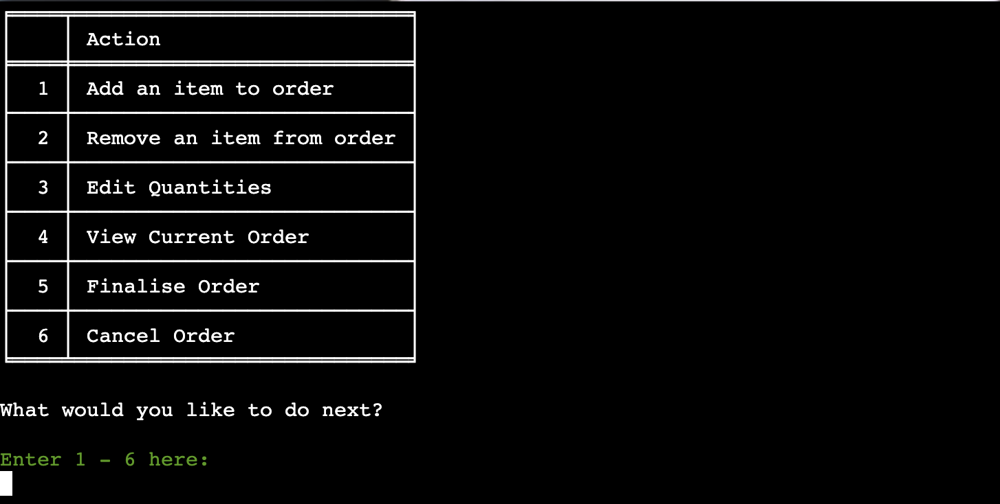
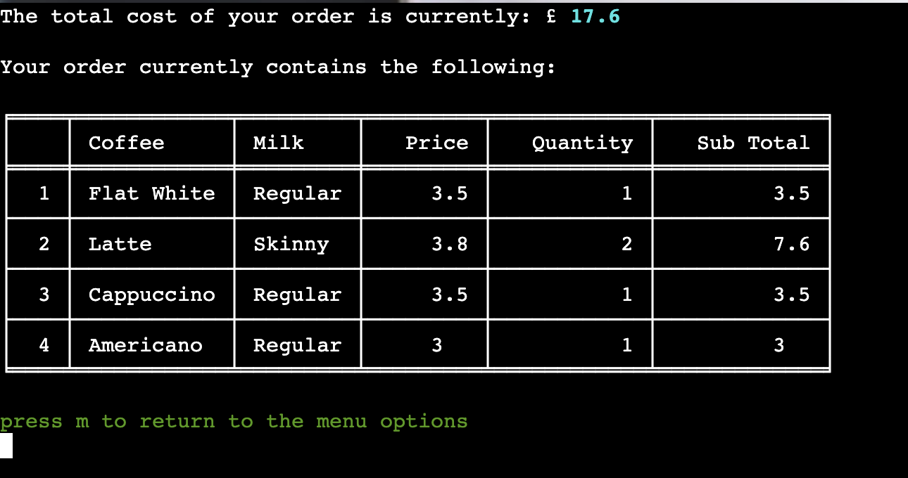
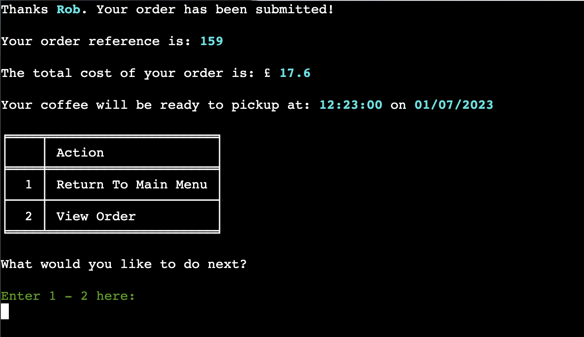
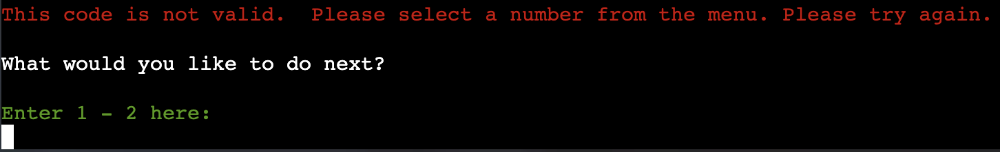
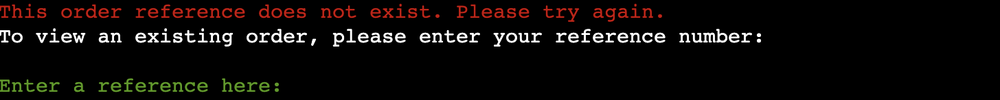

# **Testing**

 

## **Manual Testing**

 

### **Testing User Stories:**

 

### **Full Testing:**

 

The following steps have been taken to test the fuctionality of the app features and validation of user inputs:

 

**Main Menu**

 

| Functionality Tested | Expected Outcome | Testing Performed | Pass/Fail |
| ------- | ---------------- | ----------------- | --------- |
|         |
| Load App | Title, main menu and user input displayed | Click the 'Run Program' button on the landing page of the deployed app | Pass |

 

| Functionality Tested | Expected Outcome | Testing Performed | Pass/Fail |
| ------- | ---------------- | ----------------- | --------- |
|         |
| Validation for user input: **Enter 1-4 here** | Error handled and feedback message displayed to user | Attempt input of "t" "!" "empty" "5" | Pass |

| Functionality Tested | Expected Outcome | Testing Performed | Pass/Fail |
| ------- | ---------------- | ----------------- | --------- |
|         |
| Validation for user input: **Enter 1-4 here** | Input validated, call assemble_order function, user input prompt for name displayed | Input "1" | Pass |

 

**User Name**

 

| Functionality Tested | Expected Outcome | Testing Performed | Pass/Fail |
| ------- | ---------------- | ----------------- | --------- |
|         |
| Validation for user input: **Please enter your name here:** | Error handled and feedback message displayed to user | Attempt input of "88 "!!" "empty" | Pass |

| Functionality Tested | Expected Outcome | Testing Performed | Pass/Fail |
| ------- | ---------------- | ----------------- | --------- |
|         |
| Validation for user input: **Please enter your name here:** | Error handled and feedback message displayed to user | Attempt input of "rtrtrtrtrtrt" | Pass |

 

**Order Coffee**

 

| Functionality Tested | Expected Outcome | Testing Performed | Pass/Fail |
| ------- | ---------------- | ----------------- | --------- |
|         |
| Validation for user input: **Please enter your name here:** | Input validated, call the function get_menu_choice(pull_menu("coffee")) within create_item_dict function, coffee menu and prompt for user input displayed | Input of "rob" | Pass |

| Functionality Tested | Expected Outcome | Testing Performed | Pass/Fail |
| ------- | ---------------- | ----------------- | --------- |
|         |
| Validation for user input: **Please select your coffee by entering the code 1-4** | Error handled and feedback message displayed to user | Attempt input of "t" "!!" "empty" "7" | Pass |

| Functionality Tested | Expected Outcome | Testing Performed | Pass/Fail |
| ------- | ---------------- | ----------------- | --------- |
|         |
| Validation for user input: **Please select your coffee by entering the code 1-4** | Input validated, call the function get_menu_choice(pull_menu("milk")) within create_item_dict function, milk choices and prompt for user input displayed  | Input "1" "2" "3" "4" | Pass |

| Functionality Tested | Expected Outcome | Testing Performed | Pass/Fail |
| ------- | ---------------- | ----------------- | --------- |
|         |
| Validation for user input: **Please select your milk by entering the code 1-5** | Error handled and feedback message displayed to user | Attempt input of "p" "%&" "empty" "12" | Pass |

| Functionality Tested | Expected Outcome | Testing Performed | Pass/Fail |
| ------- | ---------------- | ----------------- | --------- |
|         |
| Validation for user input: **Please select your coffee by entering the code 1-5** | Input validated, call the function coffee_quantity("add") within create_item_dict function, milk choices and prompt for user input displayed  | Input "1" "2" "3" "4" "5" | Pass |

| Functionality Tested | Expected Outcome | Testing Performed | Pass/Fail |
| ------- | ---------------- | ----------------- | --------- |
|         |
| Validation for user input: **Please select a quantity between 1 and 5** | Error handled and feedback message displayed to user | Attempt input of "d" "*£" "0" "empty" | Pass |

| Functionality Tested | Expected Outcome | Testing Performed | Pass/Fail |
| ------- | ---------------- | ----------------- | --------- |
|         |
| Validation for user input: **Please select a quantity between 1 and 5** | Error handled and feedback message displayed to user | Attempt input of "12" | Pass |

| Functionality Tested | Expected Outcome | Testing Performed | Pass/Fail |
| ------- | ---------------- | ----------------- | --------- |
|         |
| Validation for user input: **Please select your coffee by entering the code 1-5** | Input validated, call the function view_order("choices") within the assemble_order function, summary of order and prompt for user input displayed  | Input "1" "2" "3" "4" "5" | Pass |

| Functionality Tested | Expected Outcome | Testing Performed | Pass/Fail |
| ------- | ---------------- | ----------------- | --------- |
|         |
| Validation for user input: **Press m to return to the menu options** | Error handled and feedback message displayed to user | Attempt input of "p" "empty" "0" | Pass |

| Functionality Tested | Expected Outcome | Testing Performed | Pass/Fail |
| ------- | ---------------- | ----------------- | --------- |
|         |
| Validation for user input: **Press m to return to the menu options** | Input validated, call the function user_menu(action_options, "order_options") within the view_order function, user options and prompt for user input displayed  | Input "m" | Pass |

| Functionality Tested | Expected Outcome | Testing Performed | Pass/Fail |
| ------- | ---------------- | ----------------- | --------- |
|         |
| Validation for user input: **Enter 1 - 6 here:** | Error handled and feedback message displayed to user | Attempt input of "e" "empty" "0" "14" | Pass |

| Functionality Tested | Expected Outcome | Testing Performed | Pass/Fail |
| ------- | ---------------- | ----------------- | --------- |
|         |
| Validation for user input: **Enter 1 - 6 here:** | Input validated, call the function next_step and then assemble_order to repeat the steps outlined above. Coffee menu and prompt for user input displayed  | Input "1" | Pass |

| Functionality Tested | Expected Outcome | Testing Performed | Pass/Fail |
| ------- | ---------------- | ----------------- | --------- |
|         |
| Validation for user input: **Please select a quantity between 1 and 5** | Error handled and feedback message displayed to user if they attempt to add item when order drinks total is at maximum | Attempt input of "1" | Pass |

 

**Remove Item**

 

| Functionality Tested | Expected Outcome | Testing Performed | Pass/Fail |
| ------- | ---------------- | ----------------- | --------- |
|         |
| Validation for user input: **Enter 1 - 6 here:** | Input validated, call the function input_options(get_keys(), "remove"). Current order summary and prompt for user input displayed  | Input "2" | Pass |

| Functionality Tested | Expected Outcome | Testing Performed | Pass/Fail |
| ------- | ---------------- | ----------------- | --------- |
|         |
| Validation for user input: **Enter a number here:** | Error handled and feedback message displayed to user | Attempt input of "e" "empty" "0" "7" | Pass |

| Functionality Tested | Expected Outcome | Testing Performed | Pass/Fail |
| ------- | ---------------- | ----------------- | --------- |
|         |
| Validation for user input: **Enter a number here:** | Input validated, call the class method remove_item and get_order_total. Call the function update_order_dict. Current order summary updated and prompt for user input displayed  | Input "1" "2" "3" "4" | Pass |

| Functionality Tested | Expected Outcome | Testing Performed | Pass/Fail |
| ------- | ---------------- | ----------------- | --------- |
|         |
| Validation for user input: **Enter a number here:** | Input validated, call the class method remove_item and get_order_total. Call the function update_order_dict. Return to main menu if no more items remain in the order | Input "1" | Pass |

 

**Edit Quantities**

 

| Functionality Tested | Expected Outcome | Testing Performed | Pass/Fail |
| ------- | ---------------- | ----------------- | --------- |
|         |
| Validation for user input: **Enter 1 - 6 here:** | Input validated, call the function input_options(get_keys(), "edit"). Current order summary and prompt for user input displayed  | Input "3" | Pass |

| Functionality Tested | Expected Outcome | Testing Performed | Pass/Fail |
| ------- | ---------------- | ----------------- | --------- |
|         |
| Validation for user input: **Enter a number here:** | Error handled and feedback message displayed to user | Attempt input of "f" "empty" "0" "9" | Pass |

| Functionality Tested | Expected Outcome | Testing Performed | Pass/Fail |
| ------- | ---------------- | ----------------- | --------- |
|         |
| Validation for user input: **Enter a number here:** | Input validated, prompt user for new quantity | Input "1" "2" "3" | Pass |

| Functionality Tested | Expected Outcome | Testing Performed | Pass/Fail |
| ------- | ---------------- | ----------------- | --------- |
|         |
| Validation for user input: **Please select a quantity between 1 and 5** | Error handled and feedback message displayed to user | Attempt input of "g" "empty" "0" | Pass |

| Functionality Tested | Expected Outcome | Testing Performed | Pass/Fail |
| ------- | ---------------- | ----------------- | --------- |
|         |
| Validation for user input: **Please select a quantity between 1 and 5** | Error handled and feedback message displayed to user | Attempt input of "3" "4" "5" "6" | Pass |

| Functionality Tested | Expected Outcome | Testing Performed | Pass/Fail |
| ------- | ---------------- | ----------------- | --------- |
|         |
| Validation for user input: **Please select a quantity between 1 and 5** | Input validated, Updated order summary and user input prompt displayed to return to options menu | Input "1" | Pass |

 

**View Current Order**

 

| Functionality Tested | Expected Outcome | Testing Performed | Pass/Fail |
| ------- | ---------------- | ----------------- | --------- |
|         |
| Validation for user input: **Enter 1 - 6 here:** | Input validated, Current order summary and prompt for user input displayed  | Input "4" | Pass |

 

**Finalise Order**

 

| Functionality Tested | Expected Outcome | Testing Performed | Pass/Fail |
| ------- | ---------------- | ----------------- | --------- |
|         |
| Validation for user input: **Enter 1 - 6 here:** | Input validated, call the function submit_order | Input "5" | Pass |
| Message including user name gives feedback that the order has been submitted | Message printed when 'Finalise Order' selected | Input "5" | Pass |
| User provided with a unique reference number for their order | Details of the order reference printed when 'Finalise Order' selected | Input "5" | Pass |
| Total Cost of the order displayed to the user | The sum of the order item subtotals printed when 'Finalise Order' selected | Input "5" | Pass |
| Estimated pickup time and date displayed to the user | The estimated time of pickup calculated using the class method calculate_prep.  It should be 2 minutes per drink in the order plus an additional 15 minutes if more than 10 drinks have been ordered recently (in the past 15 minutes - this data is retrieved by calling the get_recent function).  If less than 10 drinks have been ordered recently, an additional 10 minutes will be added to the prep time. | Input "5" | Pass |

This example below show that the order was submitted at 13:25:26 on 1/07/23.  There are fewer than 10 drinks ordered in the previous 15 minutes (There have been 5 in total), so prep time is calculated as 12 minutes ((1 drink X 2 minutes) + 10 minutes additional) and estimated pickup time is calculated as 13:37:26.

This example below shows that the order was submitted at 13:38:33 on 1/07/23.  There are more than 10 drinks ordered in the previous 15 minutes (There have been 11 in total), so prep time is calculated as 23 minutes ((4 drinks X 2 minutes) + 15 minutes additional) and estimated pickup time is calculated as 14:01:33.

| Functionality Tested | Expected Outcome | Testing Performed | Pass/Fail |
| ------- | ---------------- | ----------------- | --------- |
|         |
| Orders sheet of database updated when 'Complete Order' selected: **Enter 1 - 6 here:** | calls the function send_data(order_details, "orders") and order details are appeneded as a row in the google sheet "orders" | Input "5" | Pass |

| Functionality Tested | Expected Outcome | Testing Performed | Pass/Fail |
| ------- | ---------------- | ----------------- | --------- |
|         |
| Sales sheet of database updated when 'Complete Order' selected: **Enter 1 - 6 here:** | calls the function send_data(sales, "sales") and sales details for the order are appeneded as a row in the google sheet "sales" | Input "5" | Pass |

| Functionality Tested | Expected Outcome | Testing Performed | Pass/Fail |
| ------- | ---------------- | ----------------- | --------- |
|         |
| Validation for user input 'what would you like to do next?': **Enter 1 - 2 here** | Error handled and feedback message displayed to user | Attempt input of  "w" "!" "empty" "0" "3" | Pass |

| Functionality Tested | Expected Outcome | Testing Performed | Pass/Fail |
| ------- | ---------------- | ----------------- | --------- |
|         |
| Validation for user input 'what would you like to do next?': **Enter 1 - 2 here** | Input validated, Display summary of completed order by calling the function view_order("completed") | Input "2" | Pass |

 Functionality Tested | Expected Outcome | Testing Performed | Pass/Fail |
| ------- | ---------------- | ----------------- | --------- |
|         |
| Validation for user input 'what would you like to do next?': **Enter 1 - 2 here** | Input validated, call main function to direct user back to the main menu | Input "1" | Pass |

 

**Cancel Order**

 

| Functionality Tested | Expected Outcome | Testing Performed | Pass/Fail |
| ------- | ---------------- | ----------------- | --------- |
|         |
| Validation for user input: **Enter 1 - 6 here:** | Input validated, call the function clear_order and main to return to main menu | Input "6" | Pass |

 

**View Existing Order**

 

| Functionality Tested | Expected Outcome | Testing Performed | Pass/Fail |
| ------- | ---------------- | ----------------- | --------- |
|         |
| Validation for user input: **Enter 1-4 here** | Input validated, call the function view_completed(pull_menu("orders")), user input prompt for order reference displayed | Input "2" | Pass |

| Functionality Tested | Expected Outcome | Testing Performed | Pass/Fail |
| ------- | ---------------- | ----------------- | --------- |
|         |
| Validation for user input: **Enter a reference here:** | Error handled and feedback message displayed to user | Attempt input of "t" "!" "empty" "0" "1000" | Pass |

| Functionality Tested | Expected Outcome | Testing Performed | Pass/Fail |
| ------- | ---------------- | ----------------- | --------- |
|         |
| Validation for user input: **Enter a reference here:** | Input validated, Order details displayed | input "179" | Pass |

 

**Admin View**

 

| Functionality Tested | Expected Outcome | Testing Performed | Pass/Fail |
| ------- | ---------------- | ----------------- | --------- |
|         |
| Validation for user input: **Enter 1-4 here** | Input validated, call the function admin_stats with an argument of 10 to view sales analysis for the past 10 days | input "3" | Pass |

As you can see below, the function admin_stats filters sales for the past 10 days and uses this data to provide insight to the business owner.  In the spreadsheet below I have selected all rows for dates between 01/07/2023 and 22/06/2023 manually and you can see that the sum total of all coffees sold over this period (240) is the same figure reached by the admin_stats function.

 

**Quit App**

 

| Functionality Tested | Expected Outcome | Testing Performed | Pass/Fail |
| ------- | ---------------- | ----------------- | --------- |
|         |
| Validation for user input: **Enter 1-4 here** | Input validated, call the function quit_app to display 'Coffee Run' title and goodbye message | input "4" | Pass |

