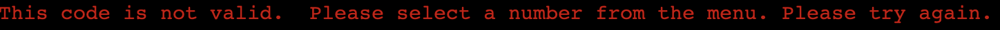
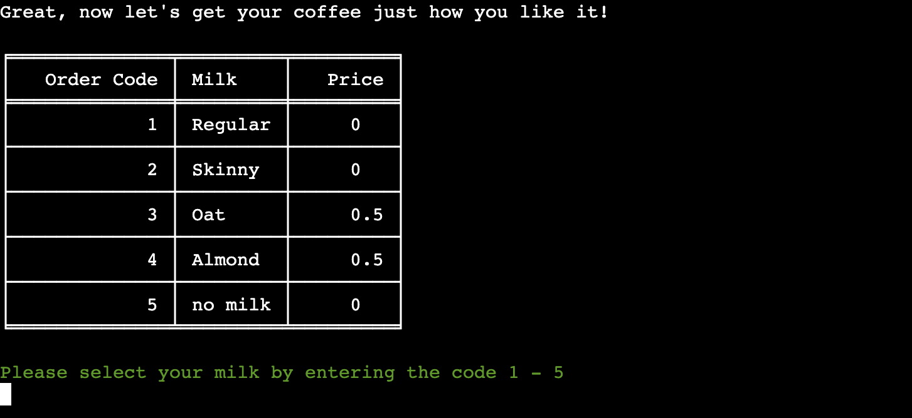
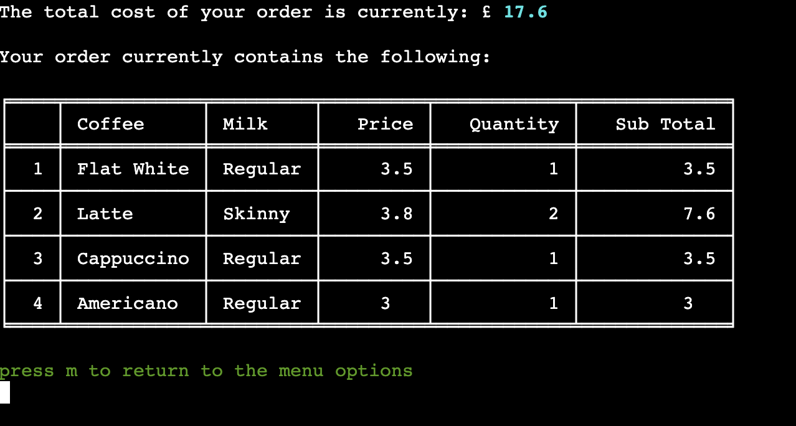

# **Testing**

## **Automated Testing**

 

## **Manual Testing**

 

### **Testing User Stories:**

 

### **Full Testing:**

 

The following steps have been taken to test the fuctionality of the app features and validation of user inputs:

 

**Main Menu**

 

| Feature Tested | Expected Outcome | Testing Performed | Pass/Fail |
| ------- | ---------------- | ----------------- | --------- |
|         |
| Load App | Title, main menu and user input displayed | Click the 'Run Program' button on the landing page of the deployed app | Pass |

 

| Feature Tested | Expected Outcome | Testing Performed | Pass/Fail |
| ------- | ---------------- | ----------------- | --------- |
|         |
| Validation for user input: **Enter 1-4 here** | Error handled and feedback message displayed to user | Attempt input of "t" "!" "empty" "5" | Pass |

| Feature Tested | Expected Outcome | Testing Performed | Pass/Fail |
| ------- | ---------------- | ----------------- | --------- |
|         |
| Validation for user input: **Enter 1-4 here** | Input validated, call assemble_order function, user input prompt for name displayed | Input "1" | Pass |

| Feature Tested | Expected Outcome | Testing Performed | Pass/Fail |
| ------- | ---------------- | ----------------- | --------- |
|         |
| Validation for user input: **Please enter your name here:** | Error handled and feedback message displayed to user | Attempt input of "88 "!!" "empty" | Pass |

| Feature Tested | Expected Outcome | Testing Performed | Pass/Fail |
| ------- | ---------------- | ----------------- | --------- |
|         |
| Validation for user input: **Please enter your name here:** | Error handled and feedback message displayed to user | Attempt input of "rtrtrtrtrtrt" | Pass |

| Feature Tested | Expected Outcome | Testing Performed | Pass/Fail |
| ------- | ---------------- | ----------------- | --------- |
|         |
| Validation for user input: **Please enter your name here:** | Input validated, call the function get_menu_choice(pull_menu("coffee")) within create_item_dict function, coffee menu and prompt for user input displayed | Input of "rob" | Pass |

| Feature Tested | Expected Outcome | Testing Performed | Pass/Fail |
| ------- | ---------------- | ----------------- | --------- |
|         |
| Validation for user input: **Please select your coffee by entering the code 1-4** | Error handled and feedback message displayed to user | Attempt input of "t" "!!" "empty" "7" | Pass |

| Feature Tested | Expected Outcome | Testing Performed | Pass/Fail |
| ------- | ---------------- | ----------------- | --------- |
|         |
| Validation for user input: **Please select your coffee by entering the code 1-4** | Input validated, call the function get_menu_choice(pull_menu("milk")) within create_item_dict function, milk choices and prompt for user input displayed  | Input "1" "2" "3" "4" | Pass |

| Feature Tested | Expected Outcome | Testing Performed | Pass/Fail |
| ------- | ---------------- | ----------------- | --------- |
|         |
| Validation for user input: **Please select your milk by entering the code 1-5** | Error handled and feedback message displayed to user | Attempt input of "p" "%&" "empty" "12" | Pass |

| Feature Tested | Expected Outcome | Testing Performed | Pass/Fail |
| ------- | ---------------- | ----------------- | --------- |
|         |
| Validation for user input: **Please select your coffee by entering the code 1-5** | Input validated, call the function coffee_quantity("add") within create_item_dict function, milk choices and prompt for user input displayed  | Input "1" "2" "3" "4" "5" | Pass |

| Feature Tested | Expected Outcome | Testing Performed | Pass/Fail |
| ------- | ---------------- | ----------------- | --------- |
|         |
| Validation for user input: **Please select a quantity between 1 and 5** | Error handled and feedback message displayed to user | Attempt input of "d" "*£" "0" "empty" | Pass |

| Feature Tested | Expected Outcome | Testing Performed | Pass/Fail |
| ------- | ---------------- | ----------------- | --------- |
|         |
| Validation for user input: **Please select a quantity between 1 and 5** | Error handled and feedback message displayed to user | Attempt input of "12" | Pass |

| Feature Tested | Expected Outcome | Testing Performed | Pass/Fail |
| ------- | ---------------- | ----------------- | --------- |
|         |
| Validation for user input: **Please select your coffee by entering the code 1-5** | Input validated, call the function view_order("choices") within the assemble_order function, summary of order and prompt for user input displayed  | Input "1" "2" "3" "4" "5" | Pass |

| Feature Tested | Expected Outcome | Testing Performed | Pass/Fail |
| ------- | ---------------- | ----------------- | --------- |
|         |
| Validation for user input: **Press m to return to the menu options** | Error handled and feedback message displayed to user | Attempt input of "p" "empty" "0" | Pass |

| Feature Tested | Expected Outcome | Testing Performed | Pass/Fail |
| ------- | ---------------- | ----------------- | --------- |
|         |
| Validation for user input: **Press m to return to the menu options** | Input validated, call the function user_menu(action_options, "order_options") within the view_order function, user options and prompt for user input displayed  | Input "m" | Pass |

| Feature Tested | Expected Outcome | Testing Performed | Pass/Fail |
| ------- | ---------------- | ----------------- | --------- |
|         |
| Validation for user input: **Enter 1 - 6 here:** | Error handled and feedback message displayed to user | Attempt input of "e" "empty" "0" "14" | Pass |

| Feature Tested | Expected Outcome | Testing Performed | Pass/Fail |
| ------- | ---------------- | ----------------- | --------- |
|         |
| Validation for user input: **Enter 1 - 6 here:** | Input validated, call the function next_step and then assemble_order to repeat the steps outlined above. Coffee menu and prompt for user input displayed  | Input "1" | Pass |

| Feature Tested | Expected Outcome | Testing Performed | Pass/Fail |
| ------- | ---------------- | ----------------- | --------- |
|         |
| Validation for user input: **Enter 1 - 6 here:** | Input validated, call the function input_options(get_keys(), "remove"). Current order summary and prompt for user input displayed  | Input "2" | Pass |

| Feature Tested | Expected Outcome | Testing Performed | Pass/Fail |
| ------- | ---------------- | ----------------- | --------- |
|         |
| Validation for user input: **Enter a number here:** | Error handled and feedback message displayed to user | Attempt input of "e" "empty" "0" "7" | Pass |

| Feature Tested | Expected Outcome | Testing Performed | Pass/Fail |
| ------- | ---------------- | ----------------- | --------- |
|         |
| Validation for user input: **Enter a number here::** | Input validated, call the class method remove_item and get_order_total. Call the function update_order_dict. Current order summary updated and prompt for user input displayed  | Input "1" "2" "3" "4" | Pass |

| Feature Tested | Expected Outcome | Testing Performed | Pass/Fail |
| ------- | ---------------- | ----------------- | --------- |
|         |
| Validation for user input: **Enter a number here::** | Input validated, call the class method remove_item and get_order_total. Call the function update_order_dict. Return to main menu if no more items remain in the order | Input "1" | Pass |

| Feature Tested | Expected Outcome | Testing Performed | Pass/Fail |
| ------- | ---------------- | ----------------- | --------- |
|         |
| Validation for user input: **Enter 1 - 6 here:** | Input validated, call the function input_options(get_keys(), "edit"). Current order summary and prompt for user input displayed  | Input "3" | Pass |

| Feature Tested | Expected Outcome | Testing Performed | Pass/Fail |
| ------- | ---------------- | ----------------- | --------- |
|         |
| Validation for user input: **Enter a number here:** | Error handled and feedback message displayed to user | Attempt input of "f" "empty" "0" "9" | Pass |

| Feature Tested | Expected Outcome | Testing Performed | Pass/Fail |
| ------- | ---------------- | ----------------- | --------- |
|         |
| Validation for user input: **Enter a number here:** | Input validated, prompt user for new quantity | Input "1" "2" "3" | Pass |

| Feature Tested | Expected Outcome | Testing Performed | Pass/Fail |
| ------- | ---------------- | ----------------- | --------- |
|         |
| Validation for user input: **Please select a quantity between 1 and 5** | Error handled and feedback message displayed to user | Attempt input of "g" "empty" "0" | Pass |

| Feature Tested | Expected Outcome | Testing Performed | Pass/Fail |
| ------- | ---------------- | ----------------- | --------- |
|         |
| Validation for user input: **Please select a quantity between 1 and 5** | Error handled and feedback message displayed to user | Attempt input of "3" "4" "5" "6" | Pass |

| Feature Tested | Expected Outcome | Testing Performed | Pass/Fail |
| ------- | ---------------- | ----------------- | --------- |
|         |
| Validation for user input: **Please select a quantity between 1 and 5** | Input validated, Updated order summary and user input prompt displayed to return to options menu | Input "1" | Pass |

