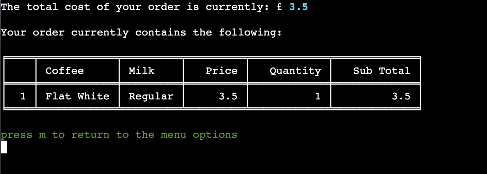
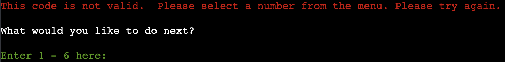
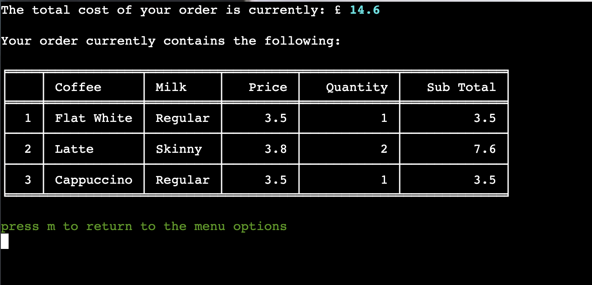
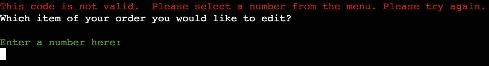
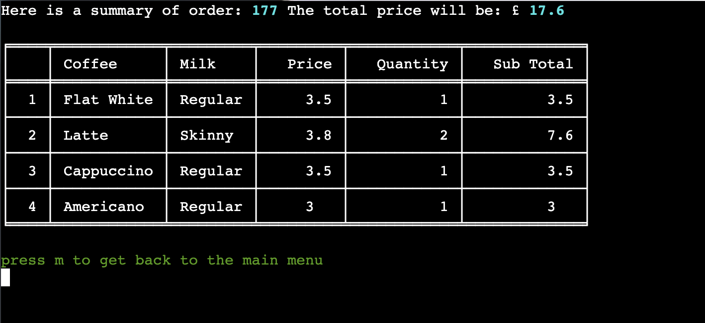

# **Testing**

 

## **Manual Testing**

 

### **Testing User Stories:**

 

| Goals | How are goals achieved? |
| --- | --- | 
| **Client** |     
|        | 
| I want to reduce queues building up inside/outside the coffee shop and maximise the number of customers that can get their coffee before catching their train. | The app achieves this by providing the user with the ability to assemble, edit and submit their coffee order remotely without the need to queue at the shop.  If payment functionality was added to the app in future implementations, this would further reduce the amount of time customers would need to spend in the shop while collecting their order. |
| I want to collect data from orders made via the app to make future business decisions. | The app achieves this by collating sales data for each order submitted and providing the business owner with an Admin View section where this data is manipulated and analysed to provide helpful statistics which can aid future business decisions.  For example, the information currently provided in the Admin View could help the business owner to increase stock of regular milk and reduce future buying of almond milk.  Future implementations could include many different functions to manipulate this sales data. For example order times and dates could be analysed to provide the business owner with statistics on the busiest times of day and help to ensure appropiate staffing levels throughout the week. |
| I want all user input to be validated and errors handled gracefully. | Validation of user input has been implemented throughout the app, ensuring that the user can only progress to the next step once their input has passed validation.  If their input cannot be validated, the user is alerted to their error and provided with useful feedback about how to progress by entering a valid value. |
| I want to ensure a good user experience by making the app easy to use and intuitive. |. The app achieves this by presenting menu options in table format.  This ensures that information is displayed in an easily digestible manner so it is clear to the user at each stage the choice they must make.  The app has been designed with the limitations of the deployed site in mind, so information displayed to the user will always fit in the terminal window without the need to scroll.  The ability to 'view order' from the options menu ensures that the user can always check items in their order before deciding to finalise and submit.  Colour coding of text in the app helps to make the user experience intuitive. Required inputs are highlighted green, input errors are flagged in red text and key pieces of information are highlighted in bold cyan text. |
| I want to keep the user informed througout the ordering process by providing feedback at each stage. | Validation of user input and error handling is designed to provide a positive user experience by keeping the user informed throughout the order process. | Bespoke messages containing the user name at each stage gives the user a more personal experience and keeps them informed about their choices / what they must do next. The 'current order' summary view contains an updated total price for the order, so users can keep track of this as they add, remove and edit items. |
|        |                                                  
| **User Goals** |         
|        |
| I want to view all avaialble coffee & milk options to make my choice. | This is achieved by displaying both menus in an easy to read tabular format, that includes price information to help the user make their decision, |
| I want to order my coffee quickly and for the experience to be intuitive. | This is achieved by presenting information to the user in a logical order and always keeping them informed about the next step throughout the ordering process.  Navigation is kept simple by never having too many levels of menu to negotiate.  They are never more than a couple steps away from returning to the main menu. |
| I want to be provided clear information about when my order will be ready to pickup. | This is achieved by displaying key information to the user once they have finalised their order, including pickup time and date.  A function has been used to try and accurately predict how long an order will take to prep, based on the number of other orders placed in the last 15 minutes.  This could be tweaked by the business owner to keep estimated pickup times as accurate as possible to ensure good user experience. |
| I want to be able to view my order details and pickup time once the order has been placed. | This is achieved by offering a 'View Existing Order' option to the user, accessed with their unique order reference number.  All key details of the order are displayed including pickup time.  If the pickup time has passed, the order status is displayed as 'READY'. |

### **Full Testing:**

 

The following steps have been taken to test the fuctionality of the app features and validation of user inputs:

 

**Main Menu**

 

| Functionality Tested | Expected Outcome | Testing Performed | Pass/Fail |
| ------- | ---------------- | ----------------- | --------- |
|         |
| Load App | Title, main menu and user input displayed | Click the 'Run Program' button on the landing page of the deployed app | Pass |

 

| Functionality Tested | Expected Outcome | Testing Performed | Pass/Fail |
| ------- | ---------------- | ----------------- | --------- |
|         |
| Validation for user input: **Enter 1-4 here** | Error handled and feedback message displayed to user | Attempt input of "t" "!" "empty" "5" | Pass |

| Functionality Tested | Expected Outcome | Testing Performed | Pass/Fail |
| ------- | ---------------- | ----------------- | --------- |
|         |
| Validation for user input: **Enter 1-4 here** | Input validated, call assemble_order function, user input prompt for name displayed | Input "1" | Pass |

 

**User Name**

 

| Functionality Tested | Expected Outcome | Testing Performed | Pass/Fail |
| ------- | ---------------- | ----------------- | --------- |
|         |
| Validation for user input: **Please enter your name here:** | Error handled and feedback message displayed to user | Attempt input of "88 "!!" "empty" | Pass |

| Functionality Tested | Expected Outcome | Testing Performed | Pass/Fail |
| ------- | ---------------- | ----------------- | --------- |
|         |
| Validation for user input: **Please enter your name here:** | Error handled and feedback message displayed to user | Attempt input of "rtrtrtrtrtrt" | Pass |

 

**Order Coffee**

 

| Functionality Tested | Expected Outcome | Testing Performed | Pass/Fail |
| ------- | ---------------- | ----------------- | --------- |
|         |
| Validation for user input: **Please enter your name here:** | Input validated, call the function get_menu_choice(pull_menu("coffee")) within create_item_dict function, coffee menu and prompt for user input displayed | Input of "rob" | Pass |

| Functionality Tested | Expected Outcome | Testing Performed | Pass/Fail |
| ------- | ---------------- | ----------------- | --------- |
|         |
| Validation for user input: **Please select your coffee by entering the code 1-4** | Error handled and feedback message displayed to user | Attempt input of "t" "!!" "empty" "7" | Pass |

| Functionality Tested | Expected Outcome | Testing Performed | Pass/Fail |
| ------- | ---------------- | ----------------- | --------- |
|         |
| Validation for user input: **Please select your coffee by entering the code 1-4** | Input validated, call the function get_menu_choice(pull_menu("milk")) within create_item_dict function, milk choices and prompt for user input displayed  | Input "1" "2" "3" "4" | Pass |

| Functionality Tested | Expected Outcome | Testing Performed | Pass/Fail |
| ------- | ---------------- | ----------------- | --------- |
|         |
| Validation for user input: **Please select your milk by entering the code 1-5** | Error handled and feedback message displayed to user | Attempt input of "p" "%&" "empty" "12" | Pass |

| Functionality Tested | Expected Outcome | Testing Performed | Pass/Fail |
| ------- | ---------------- | ----------------- | --------- |
|         |
| Validation for user input: **Please select your coffee by entering the code 1-5** | Input validated, call the function coffee_quantity("add") within create_item_dict function, milk choices and prompt for user input displayed  | Input "1" "2" "3" "4" "5" | Pass |

| Functionality Tested | Expected Outcome | Testing Performed | Pass/Fail |
| ------- | ---------------- | ----------------- | --------- |
|         |
| Validation for user input: **Please select a quantity between 1 and 5** | Error handled and feedback message displayed to user | Attempt input of "d" "*£" "0" "empty" | Pass |

| Functionality Tested | Expected Outcome | Testing Performed | Pass/Fail |
| ------- | ---------------- | ----------------- | --------- |
|         |
| Validation for user input: **Please select a quantity between 1 and 5** | Error handled and feedback message displayed to user | Attempt input of "12" | Pass |

| Functionality Tested | Expected Outcome | Testing Performed | Pass/Fail |
| ------- | ---------------- | ----------------- | --------- |
|         |
| Validation for user input: **Please select your coffee by entering the code 1-5** | Input validated, call the function view_order("choices") within the assemble_order function, summary of order and prompt for user input displayed  | Input "1" "2" "3" "4" "5" | Pass |

| Functionality Tested | Expected Outcome | Testing Performed | Pass/Fail |
| ------- | ---------------- | ----------------- | --------- |
|         |
| Validation for user input: **Press m to return to the menu options** | Error handled and feedback message displayed to user | Attempt input of "p" "empty" "0" | Pass |

| Functionality Tested | Expected Outcome | Testing Performed | Pass/Fail |
| ------- | ---------------- | ----------------- | --------- |
|         |
| Validation for user input: **Press m to return to the menu options** | Input validated, call the function user_menu(action_options, "order_options") within the view_order function, user options and prompt for user input displayed  | Input "m" | Pass |

| Functionality Tested | Expected Outcome | Testing Performed | Pass/Fail |
| ------- | ---------------- | ----------------- | --------- |
|         |
| Validation for user input: **Enter 1 - 6 here:** | Error handled and feedback message displayed to user | Attempt input of "e" "empty" "0" "14" | Pass |

| Functionality Tested | Expected Outcome | Testing Performed | Pass/Fail |
| ------- | ---------------- | ----------------- | --------- |
|         |
| Validation for user input: **Enter 1 - 6 here:** | Input validated, call the function next_step and then assemble_order to repeat the steps outlined above. Coffee menu and prompt for user input displayed  | Input "1" | Pass |

| Functionality Tested | Expected Outcome | Testing Performed | Pass/Fail |
| ------- | ---------------- | ----------------- | --------- |
|         |
| Validation for user input: **Please select a quantity between 1 and 5** | Error handled and feedback message displayed to user if they attempt to add item when order drinks total is at maximum | Attempt input of "1" | Pass |

 

**Remove Item**

 

| Functionality Tested | Expected Outcome | Testing Performed | Pass/Fail |
| ------- | ---------------- | ----------------- | --------- |
|         |
| Validation for user input: **Enter 1 - 6 here:** | Input validated, call the function input_options(get_keys(), "remove"). Current order summary and prompt for user input displayed  | Input "2" | Pass |

| Functionality Tested | Expected Outcome | Testing Performed | Pass/Fail |
| ------- | ---------------- | ----------------- | --------- |
|         |
| Validation for user input: **Enter a number here:** | Error handled and feedback message displayed to user | Attempt input of "e" "empty" "0" "7" | Pass |

| Functionality Tested | Expected Outcome | Testing Performed | Pass/Fail |
| ------- | ---------------- | ----------------- | --------- |
|         |
| Validation for user input: **Enter a number here:** | Input validated, call the class method remove_item and get_order_total. Call the function update_order_dict. Current order summary updated and prompt for user input displayed  | Input "1" "2" "3" "4" | Pass |

| Functionality Tested | Expected Outcome | Testing Performed | Pass/Fail |
| ------- | ---------------- | ----------------- | --------- |
|         |
| Validation for user input: **Enter a number here:** | Input validated, call the class method remove_item and get_order_total. Call the function update_order_dict. Return to main menu if no more items remain in the order | Input "1" | Pass |

 

**Edit Quantities**

 

| Functionality Tested | Expected Outcome | Testing Performed | Pass/Fail |
| ------- | ---------------- | ----------------- | --------- |
|         |
| Validation for user input: **Enter 1 - 6 here:** | Input validated, call the function input_options(get_keys(), "edit"). Current order summary and prompt for user input displayed  | Input "3" | Pass |

| Functionality Tested | Expected Outcome | Testing Performed | Pass/Fail |
| ------- | ---------------- | ----------------- | --------- |
|         |
| Validation for user input: **Enter a number here:** | Error handled and feedback message displayed to user | Attempt input of "f" "empty" "0" "9" | Pass |

| Functionality Tested | Expected Outcome | Testing Performed | Pass/Fail |
| ------- | ---------------- | ----------------- | --------- |
|         |
| Validation for user input: **Enter a number here:** | Input validated, prompt user for new quantity | Input "1" "2" "3" | Pass |

| Functionality Tested | Expected Outcome | Testing Performed | Pass/Fail |
| ------- | ---------------- | ----------------- | --------- |
|         |
| Validation for user input: **Please select a quantity between 1 and 5** | Error handled and feedback message displayed to user | Attempt input of "g" "empty" "0" | Pass |

| Functionality Tested | Expected Outcome | Testing Performed | Pass/Fail |
| ------- | ---------------- | ----------------- | --------- |
|         |
| Validation for user input: **Please select a quantity between 1 and 5** | Error handled and feedback message displayed to user | Attempt input of "3" "4" "5" "6" | Pass |

| Functionality Tested | Expected Outcome | Testing Performed | Pass/Fail |
| ------- | ---------------- | ----------------- | --------- |
|         |
| Validation for user input: **Please select a quantity between 1 and 5** | Input validated, Updated order summary and user input prompt displayed to return to options menu | Input "1" | Pass |

 

**View Current Order**

 

| Functionality Tested | Expected Outcome | Testing Performed | Pass/Fail |
| ------- | ---------------- | ----------------- | --------- |
|         |
| Validation for user input: **Enter 1 - 6 here:** | Input validated, Current order summary and prompt for user input displayed  | Input "4" | Pass |

 

**Finalise Order**

 

| Functionality Tested | Expected Outcome | Testing Performed | Pass/Fail |
| ------- | ---------------- | ----------------- | --------- |
|         |
| Validation for user input: **Enter 1 - 6 here:** | Input validated, call the function submit_order | Input "5" | Pass |
| Message including user name gives feedback that the order has been submitted | Message printed when 'Finalise Order' selected | Input "5" | Pass |
| User provided with a unique reference number for their order | Details of the order reference printed when 'Finalise Order' selected | Input "5" | Pass |
| Total Cost of the order displayed to the user | The sum of the order item subtotals printed when 'Finalise Order' selected | Input "5" | Pass |
| Estimated pickup time and date displayed to the user | The estimated time of pickup calculated using the class method calculate_prep.  It should be 2 minutes per drink in the order plus an additional 15 minutes if more than 10 drinks have been ordered recently (in the past 15 minutes - this data is retrieved by calling the get_recent function).  If less than 10 drinks have been ordered recently, an additional 10 minutes will be added to the prep time. | Input "5" | Pass |

This example below show that the order was submitted at 13:25:26 on 1/07/23.  There are fewer than 10 drinks ordered in the previous 15 minutes (There have been 5 in total), so prep time is calculated as 12 minutes ((1 drink X 2 minutes) + 10 minutes additional) and estimated pickup time is calculated as 13:37:26.

This example below shows that the order was submitted at 13:38:33 on 1/07/23.  There are more than 10 drinks ordered in the previous 15 minutes (There have been 11 in total), so prep time is calculated as 23 minutes ((4 drinks X 2 minutes) + 15 minutes additional) and estimated pickup time is calculated as 14:01:33.

| Functionality Tested | Expected Outcome | Testing Performed | Pass/Fail |
| ------- | ---------------- | ----------------- | --------- |
|         |
| Orders sheet of database updated when 'Complete Order' selected: **Enter 1 - 6 here:** | calls the function send_data(order_details, "orders") and order details are appeneded as a row in the google sheet "orders" | Input "5" | Pass |

| Functionality Tested | Expected Outcome | Testing Performed | Pass/Fail |
| ------- | ---------------- | ----------------- | --------- |
|         |
| Sales sheet of database updated when 'Complete Order' selected: **Enter 1 - 6 here:** | calls the function send_data(sales, "sales") and sales details for the order are appeneded as a row in the google sheet "sales" | Input "5" | Pass |

| Functionality Tested | Expected Outcome | Testing Performed | Pass/Fail |
| ------- | ---------------- | ----------------- | --------- |
|         |
| Validation for user input 'what would you like to do next?': **Enter 1 - 2 here** | Error handled and feedback message displayed to user | Attempt input of  "w" "!" "empty" "0" "3" | Pass |

| Functionality Tested | Expected Outcome | Testing Performed | Pass/Fail |
| ------- | ---------------- | ----------------- | --------- |
|         |
| Validation for user input 'what would you like to do next?': **Enter 1 - 2 here** | Input validated, Display summary of completed order by calling the function view_order("completed") | Input "2" | Pass |

 Functionality Tested | Expected Outcome | Testing Performed | Pass/Fail |
| ------- | ---------------- | ----------------- | --------- |
|         |
| Validation for user input 'what would you like to do next?': **Enter 1 - 2 here** | Input validated, call main function to direct user back to the main menu | Input "1" | Pass |

 

**Cancel Order**

 

| Functionality Tested | Expected Outcome | Testing Performed | Pass/Fail |
| ------- | ---------------- | ----------------- | --------- |
|         |
| Validation for user input: **Enter 1 - 6 here:** | Input validated, call the function clear_order and main to return to main menu | Input "6" | Pass |

 

**View Existing Order**

 

| Functionality Tested | Expected Outcome | Testing Performed | Pass/Fail |
| ------- | ---------------- | ----------------- | --------- |
|         |
| Validation for user input: **Enter 1-4 here** | Input validated, call the function view_completed(pull_menu("orders")), user input prompt for order reference displayed | Input "2" | Pass |

| Functionality Tested | Expected Outcome | Testing Performed | Pass/Fail |
| ------- | ---------------- | ----------------- | --------- |
|         |
| Validation for user input: **Enter a reference here:** | Error handled and feedback message displayed to user | Attempt input of "t" "!" "empty" "0" "1000" | Pass |

| Functionality Tested | Expected Outcome | Testing Performed | Pass/Fail |
| ------- | ---------------- | ----------------- | --------- |
|         |
| Validation for user input: **Enter a reference here:** | Input validated, Order details displayed | input "179" | Pass |

 

**Admin View**

 

| Functionality Tested | Expected Outcome | Testing Performed | Pass/Fail |
| ------- | ---------------- | ----------------- | --------- |
|         |
| Validation for user input: **Enter 1-4 here** | Input validated, call the function admin_stats with an argument of 10 to view sales analysis for the past 10 days | input "3" | Pass |

As you can see below, the function admin_stats filters sales for the past 10 days and uses this data to provide insight to the business owner.  In the spreadsheet below I have selected all rows for dates between 01/07/2023 and 22/06/2023 manually and you can see that the sum total of all coffees sold over this period (240) is the same figure reached by the admin_stats function.

 

**Quit App**

 

| Functionality Tested | Expected Outcome | Testing Performed | Pass/Fail |
| ------- | ---------------- | ----------------- | --------- |
|         |
| Validation for user input: **Enter 1-4 here** | Input validated, call the function quit_app to display 'Coffee Run' title and goodbye message | input "4" | Pass |

